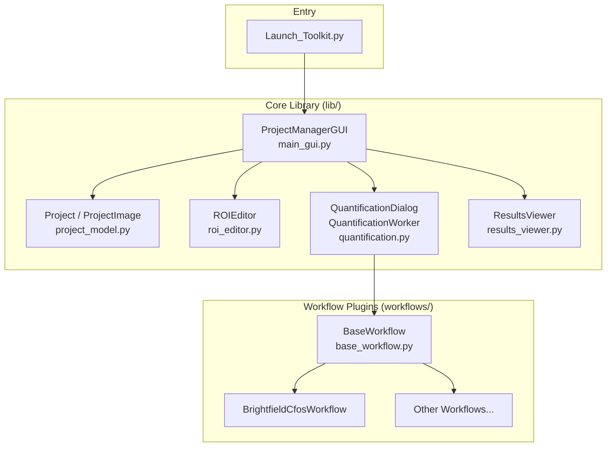
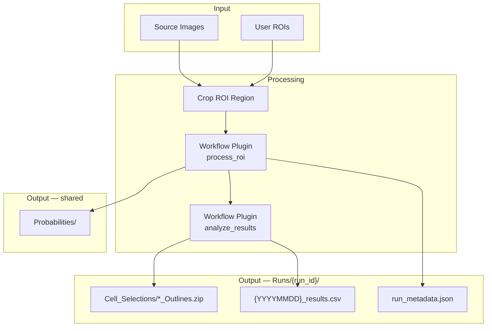

# Cell Quantification Toolkit — Architecture Overview

This document covers the high-level architecture and organizational logic of the Cell Quantification Toolkit, a Fiji plugin for managing image analysis projects and running automated cell quantification workflows.

---

## Directory Structure

```
Cell_Quantification_Toolkit/
├── Launch_Toolkit.py       # Entry point script
├── lib/                    # Core application modules
│   ├── main_gui.py         # Main GUI and application controller
│   ├── project_model.py    # Data model for projects and images
│   ├── roi_editor.py       # ROI editing interface
│   ├── quantification.py   # Batch processing orchestration
│   └── results_viewer.py   # Results visualization
├── workflows/              # Pluggable workflow system
│   ├── base_workflow.py    # Abstract base class for workflows
│   ├── brightfield_cfos.py # Example: Ilastik-based cell detection
│   └── template_workflow.py# Reference template for new workflows
├── models/                 # Ilastik classifier models (.ilp files)
└── docs/                   # Documentation
```

---

## Component Overview



---

## Module Responsibilities

### 1. Entry Point — [`Launch_Toolkit.py`](../Launch_Toolkit.py)

- **Purpose**: Bootstrap script that initializes the plugin
- **Key features**:
  - Development mode (`DEV_MODE = True`) for hot-reloading modules during development
  - Clears compiled `.class` files and reloads Python modules when in dev mode
  - Launches the main GUI on the Swing event thread

---

### 2. Main GUI — [`main_gui.py`](../lib/main_gui.py)

| Class | Purpose |
|-------|---------|
| `ProjectManagerGUI` | Main application window and controller |
| `ImageImportWorker` | Background thread for importing images |

**ProjectManagerGUI responsibilities**:
- File menu: Open/Save project
- Image table: Display and select project images
- Image operations: Import, remove, edit ROIs
- Quantification: Launch batch processing
- ROI templates: Manage predefined ROI names

**Key patterns**:
- Uses `SwingWorker` for background operations
- Maintains `Project` reference as central state
- Coordinates between sub-components (ROI editor, quantification dialog, results viewer)

---

### 3. Data Model — [`project_model.py`](../lib/project_model.py)

| Class | Purpose |
|-------|---------|
| `Project` | Represents an analysis project (folder-based) |
| `ProjectImage` | Represents a single image and its metadata |

**Project structure (on disk)**:
```
MyProject/
├── Images/                 # Source images
├── ROI_Files/              # ROI selection files ({ImageName}_ROIs.zip)
├── Probabilities/          # Workflow intermediate outputs (shared across runs)
│   └── {ImageName}_{ROIName}_{index}_probabilities.tif
│   └── {ImageName}_{ROIName}_{index}_objects.tif
├── Runs/                   # One self-contained folder per quantification run
│   └── {run_id}/           # run_id = YYYYMMDD_HHMMSS_ffffff
│       ├── Cell_Selections/    # Detected cell outlines ({ImageName}_Outlines.zip)
│       ├── {YYYYMMDD}_results.csv  # Aggregated results for this run
│       └── run_metadata.json       # Workflow, date, and settings for this run
├── temp/                   # Temporary processing files (auto-cleaned)
└── project.json            # Unified project database (images, ROIs, templates)
```

Only `Images/`, `ROI_Files/`, `Probabilities/`, and `temp/` are created when a project is opened. `Runs/` is created on demand by the first quantification run.

**Key methods**:
- `_verify_and_create_dirs()`: Ensures project directories exist
- `_load_project_json()` / `_save_project_json()`: Load/save unified JSON database
- `_migrate_to_run_based()`: Detects the pre-`Runs/` layout and, with user confirmation, removes the old root-level result files
- `_migrate_from_csv()`: Auto-migrates legacy CSV projects to JSON
- `remove_images()`: Delete images and associated files

`ProjectImage.has_outlines()` reports whether *any* run contains outlines for an image; the GUI uses it to enable the Results Viewer button.

---

### 4. ROI Editor — [`roi_editor.py`](../lib/roi_editor.py)

| Class | Purpose |
|-------|---------|
| `ROIEditor` | Modal dialog for drawing/editing regions of interest |

**Features**:
- Create, update, delete ROIs
- Hierarchical display with templates as headers
- Store metadata (name, bregma value) in ROI properties
- Commit-on-action editing model
- Save ROIs as Fiji-compatible `.zip` files

---

### 5. Quantification Engine — [`quantification.py`](../lib/quantification.py)

| Class | Purpose |
|-------|---------|
| `QuantificationDialog` | Settings dialog with workflow selection |
| `ProgressDialog` | Progress bar during batch processing |
| `QuantificationWorker` | Background thread executing workflows |

**Processing flow**:
1. User selects images and opens quantification dialog
2. Dialog dynamically loads available workflows from `workflows/` folder
3. User selects workflow and configures settings
4. `QuantificationWorker.doInBackground()`:
   - Generates a `run_id` (`YYYYMMDD_HHMMSS_ffffff`) and creates `Runs/{run_id}/Cell_Selections/`
   - Loops through each image → each ROI
   - Crops ROI region and saves as temp file
   - Delegates to workflow's `process_roi()` method
   - Calls workflow's `analyze_results()` method
   - Saves each image's cell outlines into this run's `Cell_Selections/`
5. `QuantificationWorker.done()`:
   - Aggregates results by `(filename, roi_name)`
   - Writes `Runs/{run_id}/{YYYYMMDD}_results.csv`
   - Writes `Runs/{run_id}/run_metadata.json`

---

### 6. Results Viewer — [`results_viewer.py`](../lib/results_viewer.py)

| Class | Purpose |
|-------|---------|
| `ResultsViewer` | Dialog for viewing an image with overlays |
| `RunChangeListener` | Reloads overlays and metadata when a different run is selected |
| `ImageWindowListener` | Syncs dialog lifecycle with image window |

**Features**:
- Scans `Runs/` for every run containing outlines for this image, most recent first
- Run selector dropdown (shown only when the image appears in more than one run)
- Display image with toggleable overlays:
  - Analysis ROIs (user-drawn regions, per-image and shared across runs)
  - Cell outlines (detected objects, loaded from the selected run)
- Show the selected run's processing metadata (workflow, date, and each setting) read from its `run_metadata.json`

---

## Workflow Plugin System

### Base Class — [`base_workflow.py`](../workflows/base_workflow.py)

Abstract interface that all workflows must implement:

```python
class BaseWorkflow:
    display_name = "..."        # Shown in dropdown
    description = "..."         # Tooltip
    
    def get_settings_panel(models_dict) -> JPanel    # Custom UI
    def gather_settings(panel) -> dict               # Extract settings
    def get_result_columns() -> list[str]            # Custom CSV columns
    
    # REQUIRED:
    def process_roi(cropped_imp, temp_path, prob_map_path, settings) -> ImagePlus
    def analyze_results(result_imp, roi, offset_x, offset_y, settings) -> dict
```

Whatever `gather_settings()` returns is merged into the run settings, and every JSON-serializable entry is recorded in that run's `run_metadata.json` — workflows need no separate logging hook.

### Example Implementation — [`brightfield_cfos.py`](../workflows/brightfield_cfos.py)

Implements two-stage Ilastik classification:
1. **Pixel Classification**: Generates probability maps
2. **Object Classification**: Identifies individual cells

Features:
- Resume capability (skips already-processed files)
- Configurable watershed segmentation
- Configurable edge particle exclusion

---

## Data Flow Diagram



---

## Key Design Decisions

### 1. Folder-Based Projects
Projects are simple directories with a defined structure. Data is stored in human-readable formats—CSV files for tabular data, JSON for structured metadata, and standard image formats—for maximum interoperability and easy external analysis.

### 2. Run-Based Result Storage
Project state and results are deliberately separated:

- **`project.json`** (schema `PROJECT_VERSION = "2.0"`): All project state — images, statuses, ROI templates, cached ROI counts.
- **`Runs/{run_id}/`**: Everything produced by one quantification run, kept together and never overwritten by later runs:
  - `{YYYYMMDD}_results.csv` — aggregated results (CSV so users can open it in Excel/R/Python)
  - `Cell_Selections/{ImageName}_Outlines.zip` — detected cell outlines
  - `run_metadata.json` — the run's provenance:
    - `processed_date`: ISO timestamp of when the run occurred
    - `workflow_name`: Which workflow was used
    - `workflow_settings`: The workflow's settings for this run (JSON-serializable values only; internal keys, the workflow object, and display-only options are filtered out)
    - `images_processed`: List of image filenames in this run
    - `total_results`: Count of results generated

Legacy CSV databases are auto-migrated to `project.json` on first open. Projects using the older root-level result layout (`Final_Cell_Selections/`, `Results_DB.csv`, `processing_log.json`) prompt for migration to the run-based layout; images and ROIs are preserved, old result files are removed.

### 3. Plugin Architecture for Workflows
Workflows are discovered dynamically at runtime by scanning the `workflows/` folder. This allows adding new analysis methods without modifying core code.

### 4. ROI as Source of Truth
ROI geometry and metadata (name, bregma) are stored directly in Fiji's `.zip` ROI format using custom properties, ensuring compatibility with Fiji's built-in ROI Manager.

### 5. Resume-Capable Processing
Intermediate files (probability maps, object classifications) are preserved in `Probabilities/`, allowing processing to resume after interruption. Files are named with image, ROI, and index to prevent collisions.

### 6. Metadata Traceability
The run folder name *is* the `run_id` (`YYYYMMDD_HHMMSS_ffffff`, microseconds included to prevent collisions between rapid successive runs). Because a run's results, outlines, and `run_metadata.json` all live inside that folder, results need no cross-reference key to locate the settings that produced them — the Results Viewer simply reads the metadata file sitting next to the outlines it is displaying.
