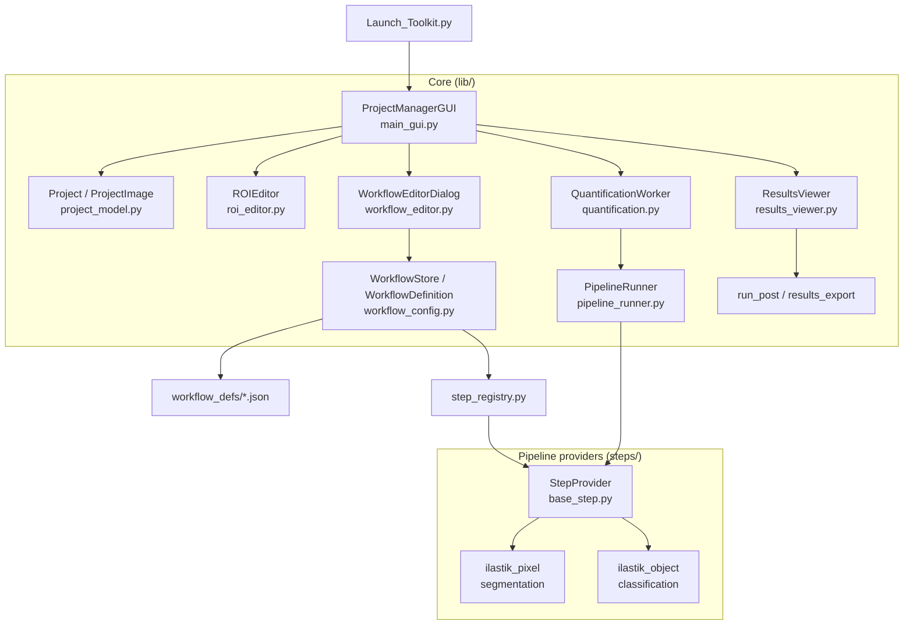

# Cell Quantification Toolkit — Architecture Overview

The Cell Quantification Toolkit is a Fiji plugin for project-based, ROI-specific
cell detection and quantification. A **workflow** is a saved JSON definition,
global and reusable across projects, of one of two kinds:

- **Automated cell classification** (`kind: "pipeline"`) — a **pipeline of three
  stages**, segmentation -> classification -> post-processing, where each stage is
  filled by a swappable **provider**, plus a class map. The expensive stages run
  once and cache their output; post-processing is tuned interactively in the
  Results tab and only written to disk on export.
- **Manual counting** (`kind: "manual"`) — just a class map; the user places
  points per class, and points inside each ROI are counted and exported.

---

## Directory Structure

```
Cell_Quantification_Toolkit/
├── Launch_Toolkit.py        # Entry point (adds plugin root to sys.path, hot-reload in DEV_MODE)
├── lib/                     # Core application modules
│   ├── main_gui.py          # Project-manager window + Current Workflow panel + Project Summary
│   ├── project_model.py     # Project / ProjectImage data model
│   ├── roi_editor.py        # ROI editing interface
│   ├── quantification.py    # Run dialog + background worker (segmentation + classification only)
│   ├── results_viewer.py    # Interactive post-processing, preview + export
│   ├── results_export.py    # Recompute from cached labels; write outlines / CSV / metadata
│   ├── postprocess.py       # run_post(): the shared post-processing step
│   ├── workflow_config.py   # WorkflowDefinition, WorkflowStore, .ilp introspection, build_workflow_instance
│   ├── workflow_editor.py   # Workflow editor dialog (automated stages or manual class map)
│   ├── step_registry.py     # Discovers step providers from steps/
│   ├── pipeline_runner.py   # Runs segmentation -> classification -> post per ROI
│   ├── manual_counter.py    # Manual point-placement dialog
│   └── manual_export.py     # Save points, count points-in-ROI, write counts CSV
├── steps/                   # Pluggable pipeline providers
│   ├── base_step.py         # StepProvider base class
│   ├── ilastik_pixel.py     # Segmentation provider (ilastik pixel classification)
│   └── ilastik_object.py    # Classification provider (ilastik object classification)
├── workflow_defs/           # Saved workflow definitions (*.json), global
├── models/                  # ilastik classifier models (.ilp)
└── docs/                    # Documentation
```

---

## Component Overview



---

## The pipeline

Every analysis is three fixed stages, each filled by a provider:

| Stage | Output token(s) | Built-in providers |
|-------|-----------------|--------------------|
| **Segmentation** | `probability_map` (or `instance_labels`) | `ilastik_pixel` |
| **Classification** | `class_labels` | `ilastik_object` (consumes `probability_map`) |
| **Post-processing** | outlines + counts | shared `run_post()` (watershed, edge/size/circularity filters) |

Providers declare what they **produce** and **consume** (contract tokens), so the
editor only offers classification providers compatible with the chosen
segmentation. New methods (e.g. StarDist segmentation, z-scored-intensity
classification) are added by dropping a `StepProvider` subclass into `steps/`;
`step_registry.py` discovers it automatically.

`pipeline_runner.PipelineRunner` executes the two expensive providers per ROI and
delegates post-processing to `postprocess.run_post()`.

---

## Workflows are definitions

A **workflow definition** (`workflow_config.WorkflowDefinition`) is data, not code
— a schema-v2 JSON file in `workflow_defs/`. An automated definition:

```json
{
  "schema_version": 2,
  "kind": "pipeline",
  "name": "Brightfield Costained cFos + CtB",
  "description": "...",
  "segmentation":   { "type": "ilastik_pixel",  "params": { "project": "..._pixel.ilp" } },
  "classification": { "type": "ilastik_object", "params": { "project": "..._object.ilp" } },
  "classes": [
    { "label": 1, "key": "cfos",     "display": "cFos",     "color": [255, 0, 0],   "include": true },
    { "label": 2, "key": "ctb",      "display": "CtB",      "color": [0, 255, 255], "include": true },
    { "label": 3, "key": "cfos_ctb", "display": "cFos+CtB", "color": [255, 255, 0], "include": true },
    { "label": 4, "key": "artifact", "display": "Artifact", "color": [128,128,128], "include": false }
  ],
  "post": { "apply_watershed": true, "exclude_edges": true, "min_cell_size": 10, "min_circularity": 0.0 }
}
```

A manual definition drops the stage/post blocks and keeps only `kind: "manual"`,
`name`, and `classes`.

- `label` is the pixel value in the classification output; `include: true` marks a
  class as a counted cell (others are ignored).
- `post` holds the starting post-processing defaults; the real tuning happens in
  the Results tab (automated only).
- Legacy v1 definitions (flat `pixel_classifier` / `object_classifier`, no `kind`)
  still load — their stages are derived automatically and upgraded to v2 on save.

`WorkflowStore` manages the `workflow_defs/` folder (list / load / save / delete).
The main window shows all definitions in a list; each project remembers its
last-used workflow name in `project.json` (`selected_workflow`) but can switch to
any workflow at any time.

---

## Run -> review -> export flow

**Automated:**

1. **Run Quantification** (`quantification.py`) runs only the expensive stages:
   per ROI it crops the region, runs segmentation + classification via the
   `PipelineRunner`, and caches the class-label image to
   `Probabilities/{image}_{roi}_{index}_objects.tif`. It writes the run's
   `run_metadata.json` (workflow snapshot + default post params) but **no CSV or
   outlines**, then opens the Results tab. Processing runs in ImageJ batch mode and
   ilastik's virtual-stack output is materialized to a real image, so intermediate
   windows are not shown and do not trigger display crashes.
2. **Results tab** (`results_viewer.py`) auto-previews the detected objects, and
   lets the user adjust post-processing (watershed, exclude edges, min area, min
   circularity) with live feedback. The same settings apply to every image.
3. **Export** (`results_export.py`) recomputes every image in the run from its
   cached labels with the chosen settings, then writes the outline zips, the
   aggregated results CSV, and the tuned `post` block back into the run folder.
   Because post-processing reads cached labels, re-tuning and re-export never
   re-run ilastik.

**Manual:**

1. **Run Quantification** opens the counting dialog (`manual_counter.py`); the user
   places points per class and **Save & Close** writes a points zip per image plus
   `run_metadata.json` (`kind: "manual"`). No CSV.
2. **Results tab** shows the points; **Export counts** (`manual_export.py`) counts
   the saved points inside each ROI and writes the CSV.

---

## On-disk project structure

```
MyProject/
├── Images/                 # Source images
├── ROI_Files/              # {ImageName}_ROIs.zip  (geometry + name + bregma)
├── Probabilities/          # Cached stage outputs, shared across runs
│   ├── {image}_{roi}_{i}_probabilities.tif
│   └── {image}_{roi}_{i}_objects.tif     # class-label image (post reads this)
├── Runs/                   # One self-contained folder per run (run_id = YYYYMMDD_HHMMSS_ffffff)
│   └── {run_id}/
│       ├── Cell_Selections/{ImageName}_Outlines.zip   # written on export
│       ├── {YYYYMMDD}_results.csv                      # written on export
│       └── run_metadata.json                          # workflow snapshot + post used
├── temp/                   # Temporary crops (auto-cleaned)
└── project.json            # Images, ROIs, templates, selected_workflow
```

Workflow definitions live globally in the plugin's `workflow_defs/`, not per
project.

---

## Module responsibilities (brief)

- **main_gui.py** — the project manager: image table + Project Summary (image and
  per-region ROI counts), the ROI-template list, and the **Current Workflow**
  panel (a list of all workflows + new / edit / duplicate / delete). Launches the
  ROI editor, run dialog / manual counter, and the **Results** tab. Branches
  Run Quantification on the workflow's `kind`.
- **project_model.py** — `Project` / `ProjectImage`; `project.json` load/save
  (`selected_workflow`), migration of legacy layouts, `has_cached_objects()` and
  `has_outlines()` for enabling review.
- **quantification.py** — `QuantificationDialog` (per-run options over the
  pre-selected workflow) and `QuantificationWorker` (segmentation + classification
  in batch mode; writes run metadata; opens the viewer).
- **workflow_config.py** — `WorkflowDefinition` (v2), `WorkflowStore`, `.ilp`
  label/colour/type introspection, and `build_workflow_instance()` which resolves
  providers from the registry and returns a `PipelineRunner`.
- **workflow_editor.py** — the editor: a **Workflow type** toggle (Automated /
  Manual). Automated shows a provider dropdown per stage (classification filtered
  by compatibility) with each provider's parameter panel; manual hides the stages.
  Both edit the class table (with "Populate from object classifier"). Providers are
  built explicitly from the definition so saved classifier choices persist.
- **step_registry.py / steps/** — provider discovery and the `StepProvider`
  interface (`produces`/`consumes`, `build_panel`, `gather_params`, `validate`,
  `run`).
- **pipeline_runner.py / postprocess.py** — run the stages and the shared
  `run_post()` post-processing.
- **results_viewer.py / results_export.py** — the Results tab: interactive tuning,
  preview, and batch export from cached labels (automated) or point counting
  (manual, via `manual_export.py`).
- **manual_counter.py / manual_export.py** — the manual point-placement dialog, and
  saving points + counting points-in-ROI + writing the counts CSV.

---

## Key design decisions

1. **Folder-based projects, human-readable outputs** — CSV for tables, JSON for
   metadata, standard image formats; easy to inspect and analyse externally.
2. **Pluggable pipeline** — fixed stages + discovered providers with
   produce/consume contracts; new methods are new files in `steps/`.
3. **Workflows as data** — reusable JSON definitions, global and selectable per
   project; the resolved definition is snapshotted into each run for provenance.
4. **Cheap post-processing, cached expensive stages** — segmentation +
   classification run once and cache label images; post-processing is interactive
   and re-exportable without re-running ilastik.
5. **Run-based results** — each run is a self-contained, timestamped folder; later
   runs never overwrite earlier ones.
6. **ROI as source of truth** — geometry + metadata stored in Fiji `.zip` ROIs.
