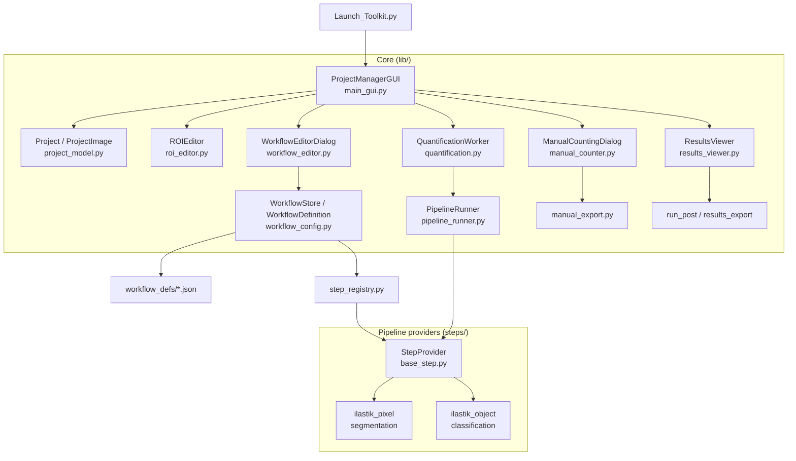

# Cell Quantification Toolkit — Architecture Overview

The Cell Quantification Toolkit is a Fiji plugin for project-based, ROI-specific
cell detection and quantification. A **workflow** is a saved JSON definition,
global and reusable across projects, of one of two kinds:

- **Automated cell classification** (`kind: "pipeline"`) — a **pipeline of three
  stages**, segmentation -> classification -> post-processing, where each stage is
  filled by a swappable **provider**, plus a class map. The expensive stages run
  once and cache their output; post-processing is tuned interactively in the
  Results viewer and only written to disk on export.
- **Manual counting** (`kind: "manual"`) — just a class map; the user places
  points per class, and points inside each ROI are counted and exported.

---

## Directory Structure

```
Cell_Quantification_Toolkit/
├── Launch_Toolkit.py        # Entry point (adds plugin root to sys.path, hot-reload in DEV_MODE)
├── lib/                     # Core application modules
│   ├── main_gui.py          # Project-manager window + Current Workflow panel + Project Summary
│   ├── project_model.py     # Project / ProjectImage data model + layout migrations
│   ├── roi_editor.py        # ROI editing interface
│   ├── quantification.py    # Run dialog + background worker (segmentation + classification only)
│   ├── results_viewer.py    # Interactive post-processing, preview + export
│   ├── results_export.py    # Recompute from cached labels; write outlines / CSV / metadata
│   ├── postprocess.py       # run_post(): the shared post-processing step
│   ├── workflow_config.py   # WorkflowDefinition, WorkflowStore, .ilp introspection,
│   │                        #   run-id / cache-dir / cache-signature helpers, build_workflow_instance
│   ├── workflow_editor.py   # Workflow editor dialog (automated stages or manual class map)
│   ├── step_registry.py     # Discovers step providers from steps/
│   ├── pipeline_runner.py   # Runs segmentation -> classification -> post per ROI
│   ├── manual_counter.py    # Manual point-placement dialog (with autosave)
│   ├── manual_export.py     # Save points, count points-in-ROI, write counts CSV
│   ├── color_lab.py         # Canonical RGB -> (R,G,B,L*,a*,b*) converter
│   └── builtin_workflows.py # Bundled definitions as Python data, seeded on first run
├── steps/                   # Pluggable pipeline providers
│   ├── base_step.py         # StepProvider base class
│   ├── ilastik_pixel.py     # Segmentation provider (ilastik pixel classification, optional RGB+Lab)
│   └── ilastik_object.py    # Classification provider (ilastik object classification)
├── workflow_defs/           # Saved workflow definitions (*.json), global
├── models/                  # ilastik classifier models (.ilp)
├── macros/                  # Standalone Fiji helpers, run from the Script Editor:
│   ├── Convert_CZI_to_Composite_RGB.ijm       # batch .czi -> 24-bit RGB TIFF
│   ├── Normalize_Background_Batch.py          # equalise illumination across sessions
│   ├── Export_RGB_plus_Lab_for_Training.py    # 6-channel RGB+Lab training images
│   ├── RGB_to_RGB_plus_Saturation.ijm         # alternative 4-channel (RGB+S) layout
│   ├── Measure_Deconvolution_Vectors.ijm      # stain vectors for Colour Deconvolution
│   └── Confusion_Matrix_Manual_vs_Automated.py # per-cell agreement between two runs
└── docs/                    # Documentation
```

None of the macros are part of the pipeline; they prepare inputs, or validate
outputs, around it. `Confusion_Matrix_Manual_vs_Automated.py` is the one to reach
for when judging a classifier: it matches individual cells between two runs of the
same project (typically a manual run as reference against an automated one), so a
missed detection and a misclassification don't cancel out the way net per-class
counts let them.

> [!NOTE]
> The per-workflow Runs/ migration lives inline in `project_model.py` as
> `_migrate_runs_to_per_workflow()`, rather than in its own module, because a
> relative import fails in that module's reload context.

---

## Component Overview



---

## The pipeline

Every automated analysis is three fixed stages, each filled by a provider:

| Stage | Output token(s) | Built-in providers |
|-------|-----------------|--------------------|
| **Segmentation** | `probability_map` (or `instance_labels`) | `ilastik_pixel` |
| **Classification** | `class_labels` | `ilastik_object` (consumes `probability_map`) |
| **Post-processing** | outlines + counts | shared `run_post()` (watershed, edge/size/circularity filters) |

Providers declare what they **produce** and **consume** (contract tokens), so the
editor only offers classification providers compatible with the chosen
segmentation. New methods (e.g. StarDist segmentation, z-scored-intensity
classification) are added by dropping a `StepProvider` subclass into `steps/`;
`step_registry.py` discovers it automatically. Post-processing is *not* pluggable —
`run_post()` is shared by every pipeline.

Providers communicate through a shared `ctx` dict, and a provider may rewrite the
input for the stages after it. `ilastik_pixel`'s optional **Append L\*a\*b\***
option (`append_lab`) does exactly that: it expands each crop to a 6-channel
R,G,B,L\*,a\*,b\* image via `lib/color_lab.py` and replaces `ctx['temp_path']`, so
the downstream object classifier sees the same layout. See
[`creating_workflows.md`](creating_workflows.md#optional-append-lab-channels).

`pipeline_runner.PipelineRunner` executes the two expensive providers per ROI and
delegates post-processing to `postprocess.run_post()`.

---

## Workflows are definitions

A **workflow definition** (`workflow_config.WorkflowDefinition`) is data, not code
— a schema-v2 JSON file in `workflow_defs/`. An automated definition:

```json
{
  "schema_version": 2,
  "kind": "pipeline",
  "name": "Brightfield Costained cFos + CtB",
  "description": "...",
  "segmentation":   { "type": "ilastik_pixel",  "params": { "project": "..._pixel.ilp", "append_lab": false } },
  "classification": { "type": "ilastik_object", "params": { "project": "..._object.ilp" } },
  "classes": [
    { "label": 1, "key": "cfos",     "display": "cFos",     "color": [255, 0, 0],   "include": true },
    { "label": 2, "key": "ctb",      "display": "CtB",      "color": [0, 255, 255], "include": true },
    { "label": 3, "key": "cfos_ctb", "display": "cFos+CtB", "color": [255, 255, 0], "include": true },
    { "label": 4, "key": "artifact", "display": "Artifact", "color": [128,128,128], "include": false }
  ],
  "post": { "apply_watershed": true, "exclude_edges": true, "min_cell_size": 10, "min_circularity": 0.0 }
}
```

A manual definition drops the stage/post blocks and keeps only `kind: "manual"`,
`name`, and `classes`.

- `label` is the pixel value in the classification output; `include: true` marks a
  class as a counted cell (others are ignored).
- `post` holds the starting post-processing defaults; the real tuning happens in
  the Results viewer (automated only).
- Legacy v1 definitions (flat `pixel_classifier` / `object_classifier`, no `kind`)
  still load — their stages are derived automatically and upgraded to v2 on save.

### Where the bundled definitions come from

The ImageJ updater only checksums a fixed set of extensions under `plugins/`
(`.jar .class .txt .ijm .py .rb .clj .js .bsh .groovy .gvy`), so a `.json` in
`workflow_defs/` is invisible to it and can never travel over the update site.
The built-ins therefore ship as Python data in `lib/builtin_workflows.py` — a
tracked `.py` — and `WorkflowStore.seed_builtins()` materializes them into
`workflow_defs/` on first run.

Seeding is name-based and idempotent: a `.seeded` marker in `workflow_defs/`
records which definitions have been written, so a built-in the user deletes stays
deleted, user edits are never overwritten, and built-ins added in a later release
are still picked up. It matches on the definition's `name` rather than its
filename, so an older install holding the same workflow under a differently-cased
file doesn't end up with a duplicate.

The same extension filter blocks `.ilp`, so classifiers are **not** shipped
either — see [`creating_workflows.md`](creating_workflows.md). The bundled
automated workflows name models the user has to supply; the manual ones need none
and work out of the box.

`WorkflowStore` manages the `workflow_defs/` folder (list / load / save / delete).
The main window shows all definitions in a list; each project remembers its
last-used workflow name in `project.json` (`selected_workflow`) but can switch to
any workflow at any time.

---

## Runs are per workflow

Output folders are keyed by **workflow**, not by execution:
`make_run_id(definition)` returns the sanitized workflow name, so re-running a
workflow reuses `Runs/<workflow-name>/`. Exported CSVs are stamped with a
timestamp *and* the post-processing settings used
(`results_<YYYYmmdd_HHMMSS>__ws1_edge1_min10_circ0p00.csv`), so successive exports
accumulate side by side instead of overwriting each other. Automated and manual
workflows have different names, so their folders never collide.

The prediction cache is scoped the same way: `Probabilities/<workflow-name>/`.
Beside it sits a `.signature` file holding
`workflow_cache_signature(definition)` — the two classifier filenames plus the
`append_lab` flag. When that signature changes, the workflow's cached
`*_probabilities.tif` / `*_objects.tif` / `*_rgblab.tif` are deleted at the start
of the next run, so an edited or swapped classifier can never reuse stale labels.
Caches are deliberately **not** shared between workflows: two automated workflows
must be able to produce different results for the same image.

> [!NOTE]
> Projects created before this layout (one timestamped folder per execution) are
> migrated on open: the old `Runs/` is moved aside to
> `Runs_pre_perworkflow_<timestamp>/` (nothing is deleted), then rebuilt grouped
> by each run's recorded `workflow_name`; old CSVs are copied in with a
> `migrated_<old-run>__` prefix. A `.per_workflow_v1` marker makes it idempotent.
> Even older layouts (`Final_Cell_Selections/`, `Results_DB.csv`) are handled by
> `Project._migrate_to_run_based()`, which asks before removing the old results.

---

## Run -> review -> export flow

**Automated:**

1. **Run Quantification** (`quantification.py`) runs only the expensive stages:
   per ROI it crops the region, runs segmentation + classification via the
   `PipelineRunner`, and caches the class-label image to
   `Probabilities/{workflow}/{image}_{roi}_{index}_objects.tif`. It writes the
   run's `run_metadata.json` (workflow snapshot + default post params) but **no
   CSV or outlines**, then reports completion and points the user at the Results
   viewer. Processing runs in ImageJ batch mode and ilastik's virtual-stack output is
   materialized to a real image, so intermediate windows are not shown and do not
   trigger display crashes.
2. **Results viewer** (`results_viewer.py`, opened from the main window's **Results**
   button) auto-previews the detected objects and lets the user adjust
   post-processing (watershed, exclude edges, min area, min circularity) with live
   feedback. When an image has output from more than one workflow, a **Run**
   dropdown switches between them; the controls re-configure themselves for the
   selected run. Tuning is disabled for manual runs and for runs with no workflow
   snapshot. An automated run whose own label cache is missing keeps its controls
   enabled but opens on its saved outlines, and says so — re-run the workflow to
   get tuning back.
3. **Export** (`results_export.py`) recomputes every image in the run from its
   cached labels with the chosen settings, then writes the outline zips, a freshly
   stamped results CSV, and the tuned `post` block back into the run's
   `run_metadata.json` (as `post_overrides`). Because post-processing reads cached
   labels, re-tuning and re-export never re-run ilastik.

**Manual:**

1. **Run Quantification** opens the counting dialog (`manual_counter.py`); the user
   places points per class. Points are autosaved to the run every 60 s and again on
   **Save & Close**, which writes a points zip per image plus `run_metadata.json`
   (`kind: "manual"`). No CSV.
2. **Results viewer** shows the points; **Export counts** (`manual_export.py`) counts
   the saved points inside each ROI and writes the CSV.

---

## On-disk project structure

```
MyProject/
├── Images/                 # Source images (copies or symlinks)
├── ROI_Files/              # {ImageName}_ROIs.zip  (geometry + name + bregma)
├── Probabilities/          # Cached stage outputs, one subfolder per workflow
│   └── {workflow}/
│       ├── .signature                                  # classifier/append_lab fingerprint
│       ├── {image}_{roi}_{i}_probabilities.tif
│       ├── {image}_{roi}_{i}_objects.tif               # class-label image (post reads this)
│       └── {image}_{roi}_{i}_rgblab.tif                # only when append_lab is on
├── Runs/                   # One self-contained folder per WORKFLOW
│   ├── .per_workflow_v1                                # migration marker
│   └── {workflow}/
│       ├── Cell_Selections/{ImageName}_Outlines.zip    # outlines (automated) or points (manual)
│       ├── results_{timestamp}__{post-stamp}.csv       # written on export, accumulates
│       └── run_metadata.json                           # workflow snapshot + post used
├── temp/                   # Temporary crops (auto-cleaned)
└── project.json            # Images, ROIs, templates, selected_workflow
```

Workflow definitions live globally in the plugin's `workflow_defs/`, not per
project.

---

## Module responsibilities (brief)

- **main_gui.py** — the project manager: image table + Project Summary (image and
  per-region ROI counts), the ROI-template list, and the **Current Workflow**
  panel (a list of all workflows + new / edit / duplicate / delete). Launches the
  ROI editor, run dialog / manual counter, and the **Results** viewer. Validates the
  definition and branches Run Quantification on the workflow's `kind`.
- **project_model.py** — `Project` / `ProjectImage`; `project.json` load/save
  (`selected_workflow`), migration of legacy layouts, `has_cached_objects()` and
  `has_outlines()` for enabling review.
- **quantification.py** — `QuantificationDialog` (per-run options over the
  pre-selected workflow) and `QuantificationWorker` (segmentation + classification
  in batch mode; per-workflow cache with signature invalidation; writes run
  metadata).
- **workflow_config.py** — `WorkflowDefinition` (v2), `WorkflowStore`, `.ilp`
  label/colour/type introspection, the run-id / cache-dir / cache-signature
  helpers, and `build_workflow_instance()` which resolves providers from the
  registry and returns a `PipelineRunner`.
- **workflow_editor.py** — the editor: a **Workflow type** toggle (Automated /
  Manual). Automated shows a provider dropdown per stage (classification filtered
  by compatibility) with each provider's parameter panel; manual hides the stages.
  Both edit the class table (with "Populate from object classifier"). Providers are
  built explicitly from the definition so saved classifier choices persist.
- **step_registry.py / steps/** — provider discovery and the `StepProvider`
  interface (`produces`/`consumes`, `build_panel`, `gather_params`, `validate`,
  `run`).
- **pipeline_runner.py / postprocess.py** — run the stages and the shared
  `run_post()` post-processing.
- **results_viewer.py / results_export.py** — the Results viewer: run selection,
  interactive tuning, preview, and batch export from cached labels (automated) or
  point counting (manual, via `manual_export.py`).
- **manual_counter.py / manual_export.py** — the manual point-placement dialog
  (with autosave), and saving points + counting points-in-ROI + writing the counts
  CSV.
- **color_lab.py** — the single RGB -> (R,G,B,L\*,a\*,b\*) conversion used by both
  the pixel provider at predict time and the training-export macro, so the two
  layouts can't drift apart.

---

## Key design decisions

1. **Folder-based projects, human-readable outputs** — CSV for tables, JSON for
   metadata, standard image formats; easy to inspect and analyse externally.
2. **Pluggable pipeline** — fixed stages + discovered providers with
   produce/consume contracts; new methods are new files in `steps/`.
3. **Workflows as data** — reusable JSON definitions, global and selectable per
   project; the resolved definition is snapshotted into each run for provenance.
4. **Cheap post-processing, cached expensive stages** — segmentation +
   classification run once and cache label images; post-processing is interactive
   and re-exportable without re-running ilastik.
5. **One results folder per workflow** — a workflow's folder is the stable place to
   look for its output, so several workflows can be compared on the same project.
   Exports never overwrite: each CSV is stamped with its timestamp and
   post-processing settings.
6. **Caches keyed by workflow and fingerprinted** — predictions are scoped to the
   workflow that produced them and invalidated when its classifiers or channel
   layout change, so results can never be silently stale or cross-attributed.
7. **ROI as source of truth** — geometry + metadata stored in Fiji `.zip` ROIs.
