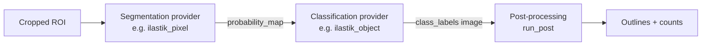
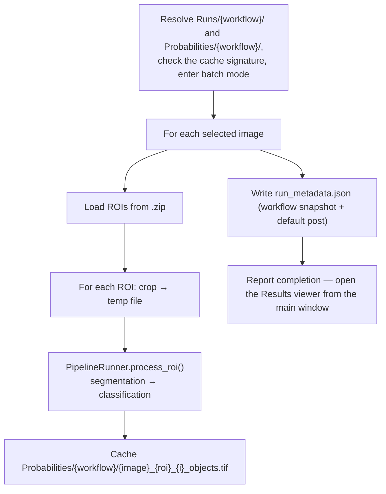

# Quantification Overview

A workflow is either **automated cell classification** (an ilastik pipeline) or
**manual counting**. In both cases, running is split into a data-gathering step
and a separate review + export step in the **Results** viewer; the CSV is only
written on export.

**Automated** is split into an expensive, run-once phase (segmentation +
classification) and a cheap, interactive phase (post-processing + export):

- **Run Quantification** (`lib/quantification.py`) runs the pipeline's expensive
  stages and caches the class-label image per ROI. It does **not** compute
  outlines or write a CSV.
- **Results viewer** (`lib/results_viewer.py`) lets you tune post-processing with
  live preview and, when satisfied, export outlines + CSV for the whole run.

**Manual** (`lib/manual_counter.py`, `lib/manual_export.py`): you place points per
class (saved, no counting), then export counts from the Results viewer. See the
Manual counting section below.

---

## Pipeline

Each analysis is three stages, each filled by a provider selected in the workflow
definition:



`build_workflow_instance()` resolves the two providers from `step_registry` and
wraps them in a `PipelineRunner`. See `architecture.md` for the provider model.

---

## Phase 1 — Run Quantification (segmentation + classification)

`QuantificationDialog` shows the already-selected workflow (chosen in the main
window's Current Workflow panel) plus per-run options (show images, force
recalculate). On run, `QuantificationWorker.doInBackground()`:



- `run_id` = the **sanitized workflow name**. Runs are one folder *per workflow*,
  not per execution: re-running reuses `Runs/<workflow>/`, and exported CSVs are
  stamped so they accumulate rather than collide.
- Predictions cache to `Probabilities/<workflow>/`. A `.signature` file there
  records the workflow's classifiers + `append_lab` flag; if it has changed since
  last time, the cached `*_probabilities.tif` / `*_objects.tif` / `*_rgblab.tif`
  are deleted first so edited models can't reuse stale labels. "Force recalculate"
  clears an individual ROI's cached maps regardless.
- Processing runs in ImageJ **batch mode** and closes ilastik's transient display
  windows, so intermediate images don't clutter the screen (unless "show images"
  is ticked).
- No outlines and no CSV are written in this phase — only the cached label images
  and the run's metadata snapshot. When it finishes you get a dialog; open the
  Results viewer yourself with the **Results** button so it doesn't pop up over your
  work.

---

## Phase 2 (automated) — Results viewer (post-processing + export)

Select an image and click **Results**. The viewer opens on the run matching the
project's currently-selected workflow (falling back to the most recently touched
run) and auto-previews detected objects.

- **Run selector** — if the image has output from more than one workflow, a
  dropdown switches between them. The controls re-configure per run: interactive
  tuning needs the run's workflow snapshot, so it is disabled for manual runs and
  for runs saved without one. Having the snapshot but not that workflow's own
  label cache is a softer case — the controls stay enabled, but the viewer opens
  on the run's saved outlines and says so, and Preview can only re-show those
  until you re-run the workflow.
- **Post-processing controls** — Apply watershed, Exclude edge particles, Min
  Cell Area, Min Circularity. Changing any control re-runs `run_post()` on the
  current image's cached labels and updates the overlay + per-class counts. No
  disk writes.
- **Export results (all images)** — applies the *same* settings to every image in
  the run: recomputes from cached labels, writes each `{ImageName}_Outlines.zip`,
  a freshly stamped `results_{timestamp}__{post-stamp}.csv`, and the tuned post
  params back into the run's `run_metadata.json` (as `post_overrides`). Images
  with no cached labels are listed as skipped.

There is one set of post-processing settings per run — it is applied uniformly to
all images, not per image. Because post-processing only reads cached labels,
re-tuning and re-export never re-run ilastik.

---

## Manual counting

For a manual-kind workflow, **Run Quantification** opens the counting tool
(`ManualCountingDialog`) instead of the pipeline:

- Select a class, then click its cells with the multi-point tool. The active
  class is the live `PointRoi`; other classes render as a coloured overlay; per
  class counts update live. Navigate between the selected images with Prev/Next.
- Points **autosave every 60 seconds** into the session's run (silently — failures
  only go to the Log), so a crash or accidental close doesn't lose work.
- **Save & Close** writes a points zip per image
  (`Runs/{workflow}/Cell_Selections/{Image}_Outlines.zip`, one `PointRoi` per
  class) plus the run metadata. **No counting or CSV happens here.**

Then, in the **Results** viewer, **Export counts (all images)** counts the saved
points inside each analysis ROI (a point is counted in every ROI that contains
it) and writes the aggregated CSV. Post-processing controls are disabled for
manual runs.

---

## Output files

| File | Location | When | Content |
|------|----------|------|---------|
| Probability / label maps | `Probabilities/{workflow}/` | Run Quantification (automated) | Cached stage outputs, scoped + fingerprinted per workflow |
| Cell outlines / points | `Runs/{workflow}/Cell_Selections/{Image}_Outlines.zip` | Export (automated) / Save + autosave (manual) | Outlines (automated) or per-class points (manual), tagged with `cell_class` |
| Results table | `Runs/{workflow}/results_{timestamp}__{post-stamp}.csv` | Export | Aggregated per-class counts (+ areas for automated) |
| Run metadata | `Runs/{workflow}/run_metadata.json` | Run + Export | Workflow definition snapshot and post params used. Manual runs also carry a top-level `kind: "manual"` — that key is how the Results viewer tells the two apart, so automated runs simply omit it |

The post-stamp encodes the settings that produced the CSV — e.g.
`ws1_edge0_min10_circ0p00` = watershed on, edge exclusion off, min area 10, min
circularity 0.00 (manual exports use `manual`). Nothing is overwritten, so you can
compare exports at different settings directly.

### Results schema

Base columns + per included class. Automated runs emit a `count` and
`total_area` per class; manual runs emit `count` only:

```csv
# automated
filename, roi_name, roi_area, bregma_value, cfos_count, cfos_total_area, ctb_count, ctb_total_area, cfos_ctb_count, cfos_ctb_total_area
# manual
filename, roi_name, roi_area, bregma_value, cfos_count, ctb_count
```

Rows are aggregated by `(filename, roi_name)`: areas and per-class counts are
summed, bregma values averaged.

> The CSV carries no run-ID column — the enclosing folder name *is* the workflow,
> the filename carries the export time and settings, and the full workflow
> snapshot (providers, classifiers, class map, and the post-processing settings
> used for the export) lives in `run_metadata.json` beside it.
