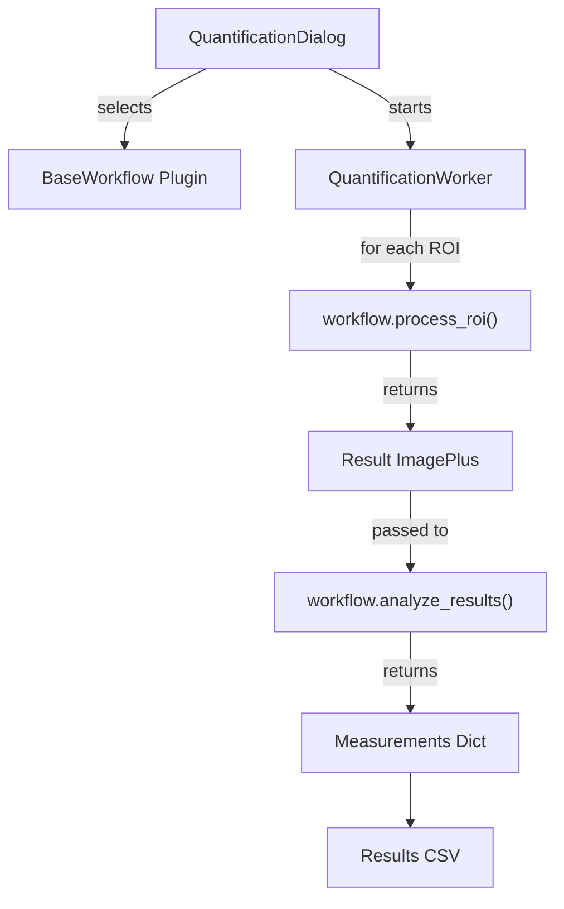
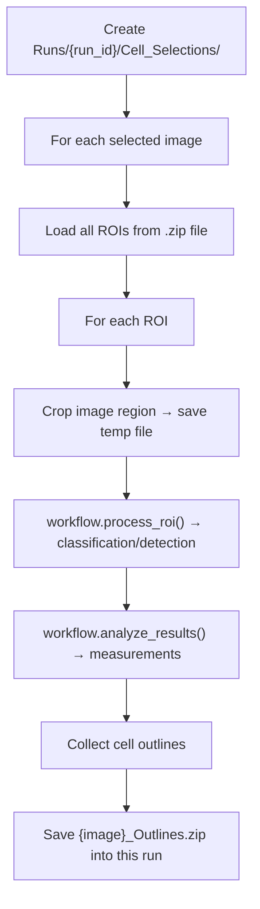
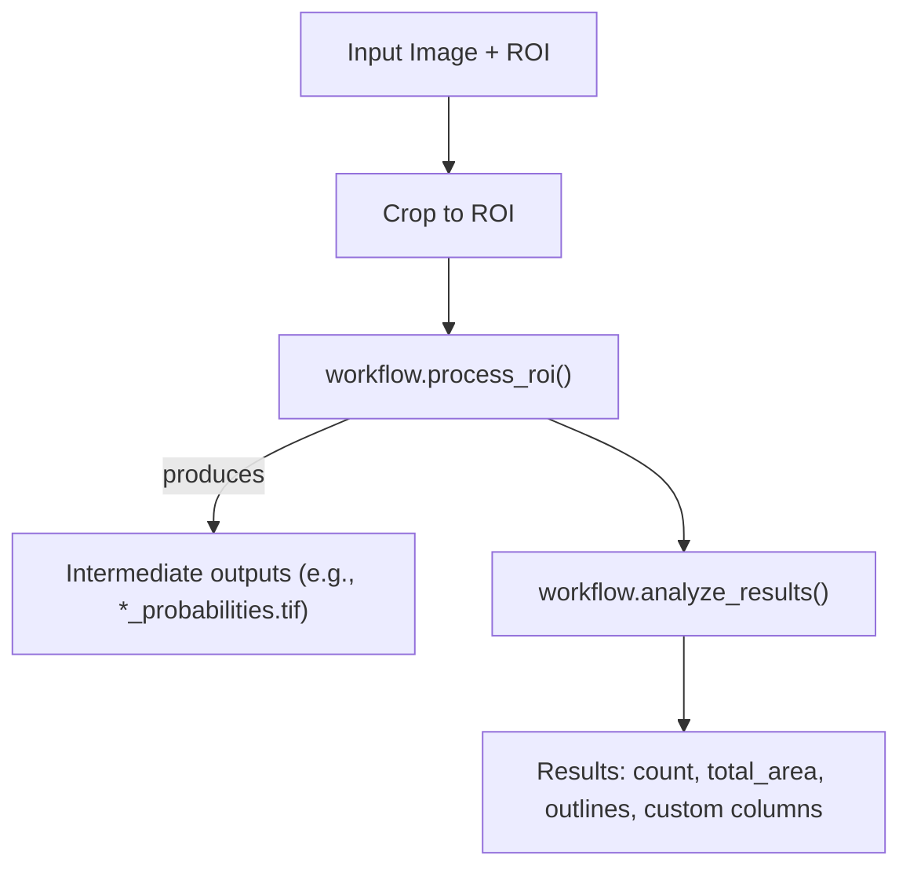

# Quantification Module Overview

The quantification module (`lib/quantification.py`) performs automated cell detection and counting via a **plugin-based workflow architecture**. Workflows are dynamically discovered from the `workflows/` folder, enabling easy extension without modifying core code.

---

## Architecture



| Component | Purpose |
|-----------|---------|
| `_discover_workflows()` | Scans `workflows/` and loads all `BaseWorkflow` subclasses |
| `QuantificationDialog` | Modal dialog with workflow dropdown and dynamic settings panels |
| `QuantificationWorker` | SwingWorker for background batch processing |
| `BaseWorkflow` | Abstract base class defining the plugin interface |

---

## Workflow Plugin System

### Plugin Discovery
At startup, `_discover_workflows()` scans the `workflows/` folder:
1. Loads `base_workflow.py` to get the `BaseWorkflow` class
2. Imports all other `.py` files (excluding files starting with `_`)
3. Instantiates any class that subclasses `BaseWorkflow`
4. Returns a dict of `{display_name: workflow_instance}`

### BaseWorkflow Interface

```
workflows/base_workflow.py
```

| Method | Required | Purpose |
|--------|----------|---------|
| `display_name` | Yes | String shown in workflow dropdown |
| `description` | No | Tooltip text |
| `get_settings_panel(models_dict)` | No | Returns JPanel with custom UI controls |
| `gather_settings(panel)` | No | Extracts settings dict from panel |
| `get_result_columns()` | No | Returns list of custom CSV column names |
| `process_roi(cropped_imp, temp_path, prob_map_path, settings)` | **Yes** | Run detection/classification logic; returns ImagePlus |
| `analyze_results(result_imp, roi, offset_x, offset_y, settings)` | **Yes** | Extract measurements; returns dict with `outlines` plus the keys named by `get_result_columns()` |

### Built-in Workflows

| Workflow | File | Description |
|----------|------|-------------|
| **Brightfield cFos** | `brightfield_cfos.py` | Two-step Ilastik classification (pixel → object) with watershed segmentation |
| **Template Workflow** | `template_workflow.py` | Comprehensive template demonstrating all UI controls and processing methods |

---

## Processing Pipeline

### 1. Configuration Phase
`QuantificationDialog` presents:
- **Workflow dropdown** — dynamically populated from discovered plugins
- **Workflow settings panel** — swapped when workflow selection changes
- **Display option** — show/hide intermediate images

### 2. Batch Processing
`QuantificationWorker.doInBackground()` first mints a `run_id` and creates this run's folder, then processes each image:



The `run_id` is `YYYYMMDD_HHMMSS_ffffff` — microseconds are included so two runs started in the same second cannot collide.

### 3. Workflow Delegation
The worker delegates processing to the selected workflow plugin:

```python
# In QuantificationWorker.doInBackground():
result_imp = workflow.process_roi(cropped_imp, temp_path, prob_map_path, settings)
analysis = workflow.analyze_results(result_imp, crop_roi, roi_x, roi_y, settings)
```

### 4. Result Aggregation
In `done()`, results are aggregated by `(filename, roi_name)`:
- ROI areas are summed
- Custom numeric columns are summed
- Bregma values are averaged

The aggregated table and the run's metadata are then written into the run folder created in step 2.

---

## Data Flow



---

## Output Files

Every run writes into its own folder, `Runs/{run_id}/`. The only shared output is the probability maps, which are reused across runs to support resuming.

| File | Location | Content |
|------|----------|---------|
| Probability maps | `Probabilities/` | Intermediate classification output, shared across runs |
| Cell outlines | `Runs/{run_id}/Cell_Selections/` | One `{ImageName}_Outlines.zip` per image |
| Results table | `Runs/{run_id}/{YYYYMMDD}_results.csv` | Aggregated quantification data for this run |
| Run metadata | `Runs/{run_id}/run_metadata.json` | Workflow name, timestamp, settings, images processed |

### Results Schema
Base columns + workflow-specific columns:
```csv
filename, roi_name, roi_area, bregma_value, [workflow_columns...]
```

> [!NOTE]
> **Metadata Coupling**: The results CSV carries no run ID column — the enclosing folder name *is* the run ID. The full snapshot of settings (thresholds, model paths, etc.) used to produce a CSV lives in the `run_metadata.json` beside it:
> ```json
> {
>   "processed_date": "2026-07-28T14:30:22.871000",
>   "workflow_name": "Brightfield cFos",
>   "workflow_settings": { "apply_watershed": true, "exclude_edges": false },
>   "images_processed": ["01_Slice.tif", "02_Slice.tif"],
>   "total_results": 8
> }
> ```
> `workflow_settings` is populated automatically from `gather_settings()` — non-serializable and display-only values are filtered out, so workflows need no separate logging hook.

Example for Brightfield cFos (each workflow defines its own columns via `get_result_columns()`):
```csv
filename, roi_name, roi_area, bregma_value, cell_count, total_cell_area
```

> [!NOTE]
> Multiple ROI sub-regions with the same name are aggregated in the final results, with bregma values averaged.

---