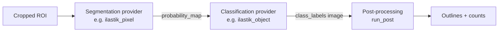
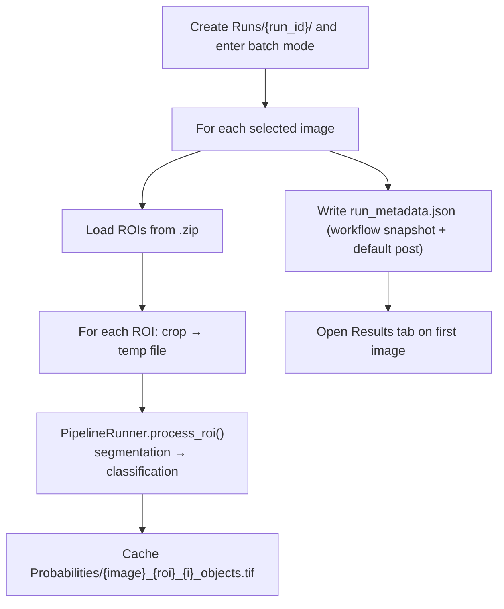

# Quantification Overview

A workflow is either **automated cell classification** (an ilastik pipeline) or
**manual counting**. In both cases, running is split into a data-gathering step
and a separate review + export step in the **Results** tab; the CSV is only
written on export.

**Automated** is split into an expensive, run-once phase (segmentation +
classification) and a cheap, interactive phase (post-processing + export):

- **Run Quantification** (`lib/quantification.py`) runs the pipeline's expensive
  stages and caches the class-label image per ROI. It does **not** compute
  outlines or write a CSV.
- **Results tab** (`lib/results_viewer.py`) lets you tune post-processing with
  live preview and, when satisfied, export outlines + CSV for the whole run.

**Manual** (`lib/manual_counter.py`, `lib/manual_export.py`): you place points per
class (saved, no counting), then export counts from the Results tab. See the
Manual counting section below.

---

## Pipeline

Each analysis is three stages, each filled by a provider selected in the workflow
definition:



`build_workflow_instance()` resolves the two providers from `step_registry` and
wraps them in a `PipelineRunner`. See `architecture.md` for the provider model.

---

## Phase 1 — Run Quantification (segmentation + classification)

`QuantificationDialog` shows the already-selected workflow (chosen in the main
window's Current Workflow panel) plus per-run options (show images, force
recalculate). On run, `QuantificationWorker.doInBackground()`:



- `run_id` = `YYYYMMDD_HHMMSS_ffffff` (microseconds prevent collisions).
- Processing runs in ImageJ **batch mode** and closes ilastik's transient display
  windows, so intermediate images don't clutter the screen (unless "show images"
  is ticked).
- No outlines and no CSV are written in this phase — only the cached label images
  and the run's metadata snapshot.

---

## Phase 2 (automated) — Results tab (post-processing + export)

The Results tab opens on the first processed image and auto-previews detected objects.

- **Post-processing controls** — Apply watershed, Exclude edge particles, Min
  Cell Area, Min Circularity. Changing any control re-runs `run_post()` on the
  current image's cached labels and updates the overlay + per-class counts. No
  disk writes.
- **Export results (all images)** — applies the *same* settings to every image in
  the run: recomputes from cached labels, writes each `{ImageName}_Outlines.zip`,
  the aggregated `{YYYYMMDD}_results.csv`, and the tuned `post` block back into the
  run's `run_metadata.json`.

There is one set of post-processing settings per run — it is applied uniformly to
all images, not per image. Because post-processing only reads cached labels,
re-tuning and re-export never re-run ilastik.

---

## Manual counting

For a manual-kind workflow, **Run Quantification** opens the counting tool
(`ManualCountingDialog`) instead of the pipeline:

- Select a class, then click its cells with the multi-point tool. The active
  class is the live `PointRoi`; other classes render as a coloured overlay; per
  class counts update live. Navigate between the selected images with Prev/Next.
- **Save & Close** writes a points zip per image
  (`Runs/{run_id}/Cell_Selections/{Image}_Outlines.zip`, one `PointRoi` per class)
  plus the run metadata. **No counting or CSV happens here.**

Then, in the **Results** tab, **Export counts (all images)** counts the saved
points inside each analysis ROI (a point is counted in every ROI that contains
it) and writes the aggregated CSV. Post-processing controls are disabled for
manual runs.

---

## Output files

| File | Location | When | Content |
|------|----------|------|---------|
| Probability / label maps | `Probabilities/` | Run Quantification (automated) | Cached stage outputs, shared across runs |
| Cell outlines / points | `Runs/{run_id}/Cell_Selections/{Image}_Outlines.zip` | Export (automated) / Save (manual) | Outlines (automated) or per-class points (manual), tagged with `cell_class` |
| Results table | `Runs/{run_id}/{YYYYMMDD}_results.csv` | Export | Aggregated per-class counts (+ areas for automated) |
| Run metadata | `Runs/{run_id}/run_metadata.json` | Run + Export | Workflow definition snapshot, `kind`, and post params used |

### Results schema

Base columns + per included class. Automated runs emit a `count` and
`total_area` per class; manual runs emit `count` only:

```csv
# automated
filename, roi_name, roi_area, bregma_value, cfos_count, cfos_total_area, ctb_count, ctb_total_area, cfos_ctb_count, cfos_ctb_total_area
# manual
filename, roi_name, roi_area, bregma_value, cfos_count, ctb_count
```

Rows are aggregated by `(filename, roi_name)`: areas and per-class counts are
summed, bregma values averaged.

> The CSV carries no run-ID column — the enclosing folder name *is* the run ID,
> and the full workflow snapshot (providers, classifiers, class map, and the
> post-processing settings used for the export) lives in `run_metadata.json`
> beside it.
